# Library Management Showcase

Public showcase repository for the **Library Management System** desktop project.

## At A Glance

**Library Management** is a Java Swing desktop application built to support daily library operations such as book rental and return, inventory management, student management, staff administration, reviews, damage tracking, and reporting.

- Project type: Team-based academic capstone / desktop product showcase
- Project format: Internal library operations desktop application
- My role: Team leader and full-stack contributor focused on core workflows, inventory logic, integrations, and project delivery
- Main stack: Java SE 21, Java Swing, Maven, SQL Server
- Key highlights: book rental and return, inventory and location management, QR-based warehouse scan, Vbee audio description, reporting, recycle bin
- Demo video: [YouTube walkthrough](https://www.youtube.com/watch?v=oornKFK1SJk)
- Recognition: [Featured by Aptech Vietnam](https://aptechvietnam.com.vn/san-pham-hoc-vien/do-an-he-thong-quan-ly-thu-vien-library-management/)
- Public source note: this repository intentionally excludes the full private source code and focuses on architecture, features, screenshots, and my responsibilities

## Quick Links

- [My Contributions](#my-contributions)
- [What Makes This Project Notable](#what-makes-this-project-notable)
- [Live Links](#live-links)
- [Screenshots](#screenshots)
- [System Flow](#system-flow)
- [Repository Structure](#repository-structure)
- [Private Source Code Note](#private-source-code-note)
- [Supporting Documents](#supporting-documents)

## Overview

Library Management is a Java Swing desktop application built to make internal library workflows more accurate, structured, and efficient. The project combines rental and return operations, inventory management, location tracking, personnel approval, damage handling, ratings, and chart-based reporting in one system.

This public repository is designed for recruiters, interviewers, and reviewers who want to quickly understand the project without accessing the private implementation source code.

The system supports both administrative and staff-side operations:

- Admin can manage books, damaged books, inventory, locations, personnel, reports, and deleted records
- Staff can log in, search books, manage rentals and returns, review borrow history, and work with book detail and rating features
- The system updates book status and stock levels as borrow and return transactions happen
- Library data is organized across books, authors, publishers, categories, students, locations, payments, reviews, and history records

## My Contributions

Based on the team work log in the final report, I was responsible for:

- Creating and updating the database design
- Implementing the book management workflows
- Building the borrowing and rental flows
- Implementing inventory management
- Designing and managing book locations
- Supporting the application interface and overall user experience
- Integrating audiobook generation through the Vbee API
- Implementing QR-based inventory support for warehouse workflows

I also led the team and coordinated the project delivery across the semester, helping connect database work, operational flows, UI modules, and feature integration into one finished product.

## What Makes This Project Notable

- Desktop-first library operations workflow using Java Swing
- Book rental and return flow with student lookup and due-date handling
- Book detail popup with long-form description and voice playback using the Vbee API
- Warehouse workflow with QR scanning support using phone camera + DroidCam
- Structured location management by floor, row, shelf, and shelf level
- Damage tracking flow with pending, under repair, replaced, and discarded states
- Recycle bin for restoring or permanently deleting removed records
- Reporting and analytics views for borrow volume, revenue, and category statistics

## Live Links

- Project Demo Video: [https://www.youtube.com/watch?v=oornKFK1SJk](https://www.youtube.com/watch?v=oornKFK1SJk)
- Featured Project Article: [https://aptechvietnam.com.vn/san-pham-hoc-vien/do-an-he-thong-quan-ly-thu-vien-library-management/](https://aptechvietnam.com.vn/san-pham-hoc-vien/do-an-he-thong-quan-ly-thu-vien-library-management/)

## Highlights

- Staff-facing workflow for book rental, return, and student lookup
- Book detail pages with long description and voice playback
- QR-assisted warehouse and inventory handling
- Location mapping by floor, row, shelf, and shelf level
- Damage, repair, and discard workflow for broken books
- Personnel approval and account activation flow
- Recycle bin recovery for soft-deleted records
- Reporting and chart views for borrow and revenue activity
- Login and register flow with approval-based staff access
- Student profile and borrowing management
- Book review and rating moderation
- Borrow history inspection with order details

## Tech Stack

- Language: Java SE 21
- UI: Java Swing
- Build Tool: Maven
- Database: SQL Server
- Reporting: JasperReports
- Barcode / QR: ZXing
- Image / Camera / Video: OpenCV, JavaCV, FFmpeg, DroidCam workflow
- Audio: Vbee text-to-speech API
- Utilities: Apache POI, Log4j, BCrypt, JSON, JDBC

## Deployment Workflow

This project is a local desktop application connected to SQL Server, so it is not deployed to a public server like a web application.

The typical run workflow is:

- import the SQL Server database
- configure database credentials in `db.properties`
- open the Maven project in Eclipse or VS Code
- ensure Java SE 21 is selected
- run `src/main/java/gui/Main.java`

For reviewer-friendly access, this showcase repository provides:

- UI screenshots extracted from the project report
- System flow documentation
- Feature breakdowns
- Database ERD
- Technical notes about integrations and deployment setup

A recorded walkthrough or guided demo session can be provided on request.

## Recognition

- Library Management was featured by Aptech Vietnam as one of the representative student projects for Semester 2
- Public article: [Đồ án hệ thống quản lý thư viện - Library Management](https://aptechvietnam.com.vn/san-pham-hoc-vien/do-an-he-thong-quan-ly-thu-vien-library-management/)

## Screenshots

### Splash / Branding

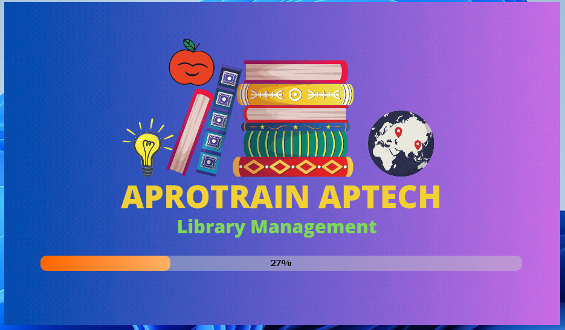

### Login & Register

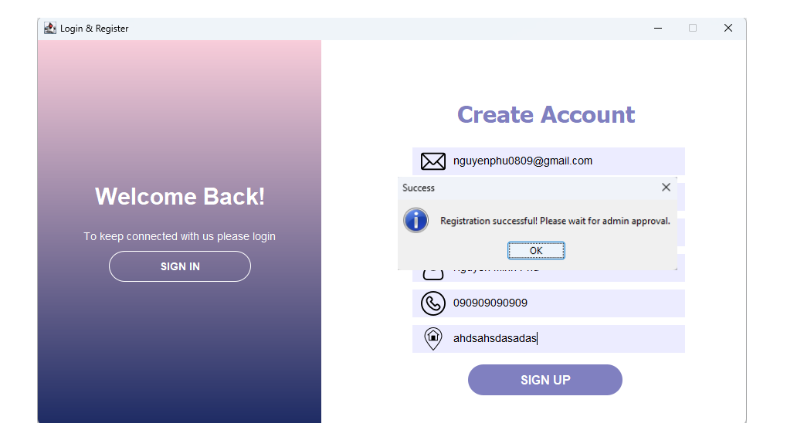

### Main Dashboard

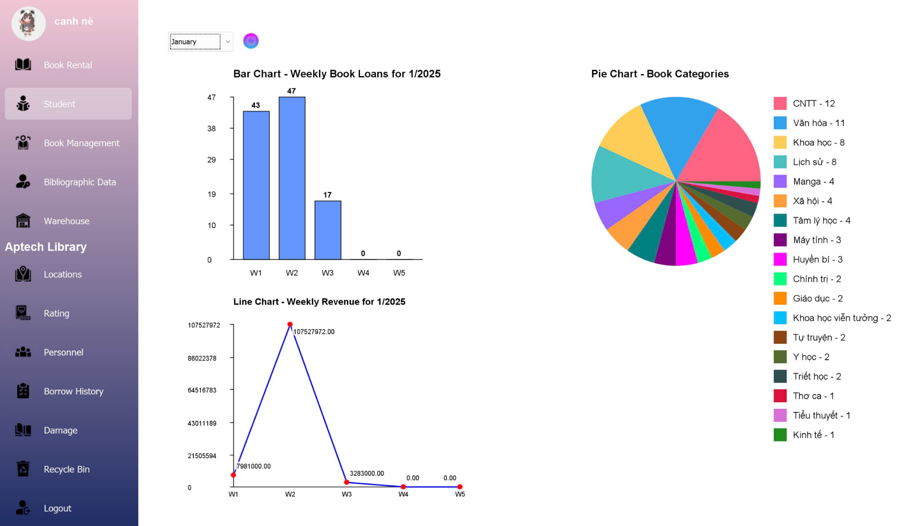

### Book Rental Workflow

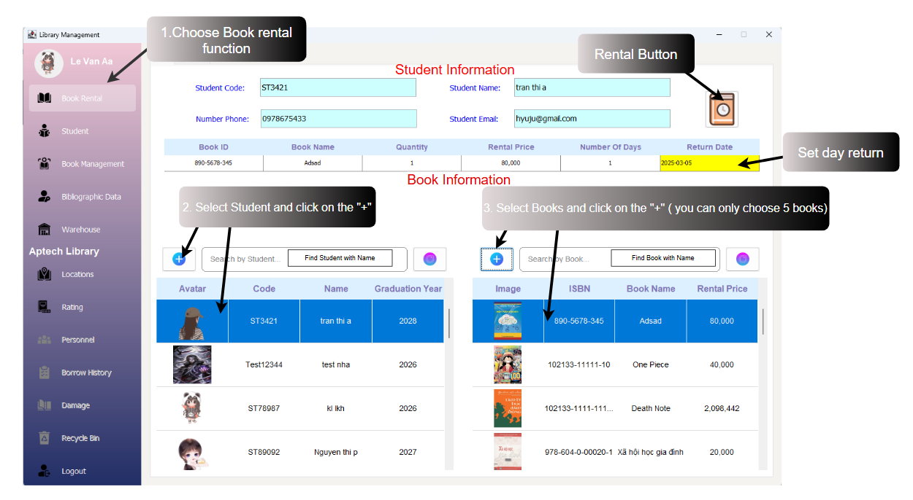

### Student Management

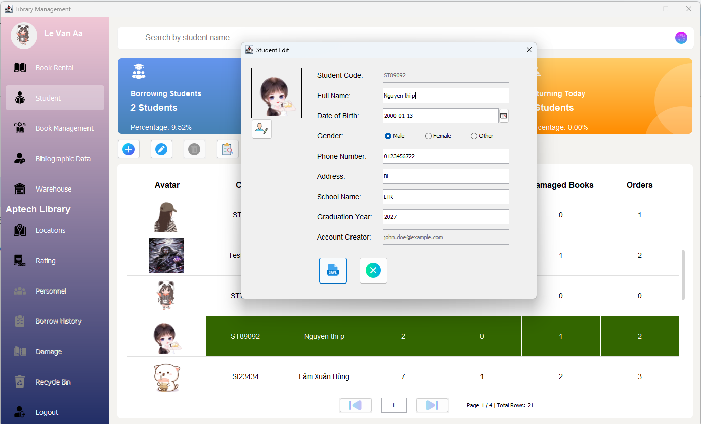

### Book Description + Audio Playback

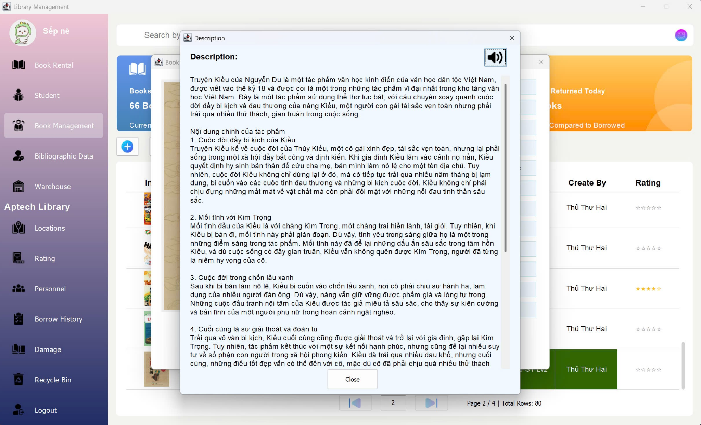

### Warehouse QR Scan

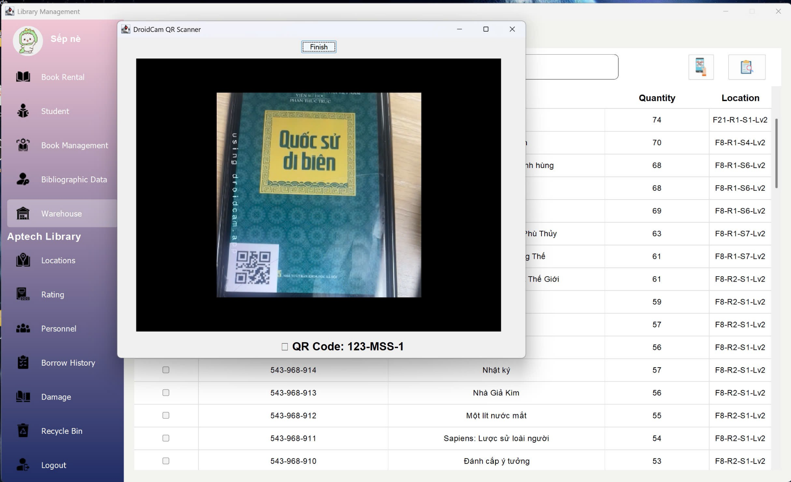

### Location Management

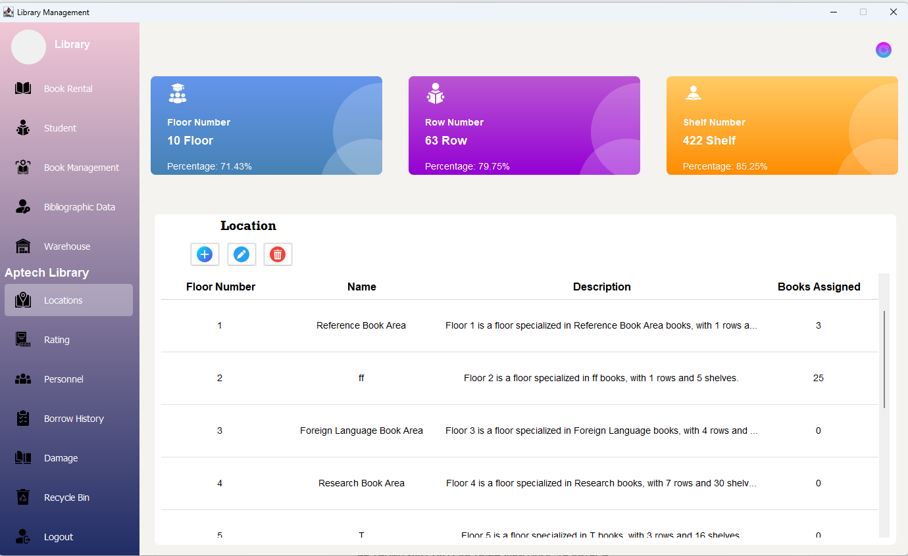

### Rating Management

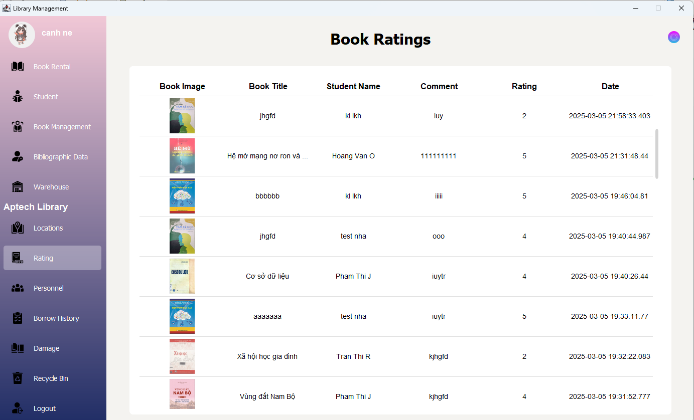

### Personnel Management

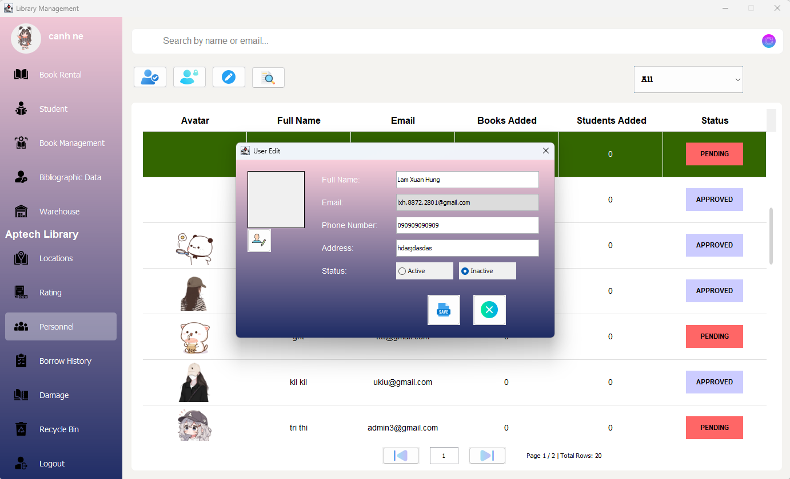

### Borrow History

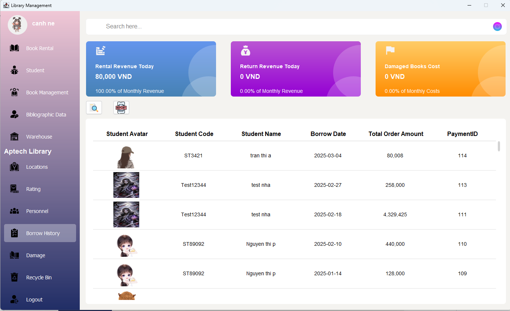

### Damage Management

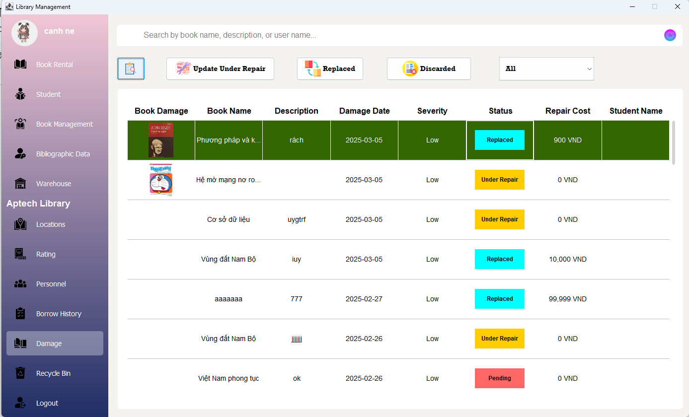

### Recycle Bin

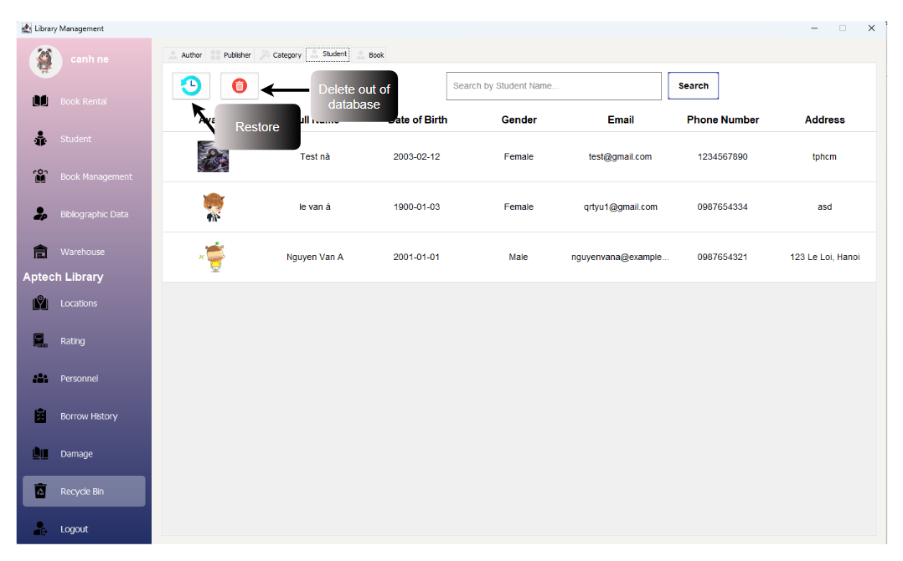

## System Flow

The full system flow is available in:

- [system-flow.html](system-flow.html)

GitHub can also render the Mermaid diagrams directly in this README.

### Authentication & Approval Flow

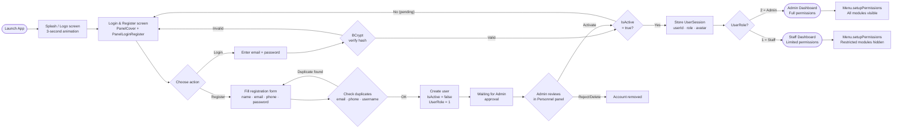
```mermaid
flowchart LR
    START([Launch App]) --> SPLASH["Splash / Logo screen\n3-second animation"]
    SPLASH --> LOGIN_SCREEN["Login & Register screen\nPanelCover + PanelLoginRegister"]

    LOGIN_SCREEN --> ACT{"Choose action"}

    ACT -- "Login" --> CRED["Enter email + password"]
    CRED --> BCRYPT{"BCrypt\nverify hash"}
    BCRYPT -- "Invalid" --> LOGIN_SCREEN
    BCRYPT -- "Valid" --> ACTIVE{"IsActive\n= true?"}
    ACTIVE -- "No (pending)" --> LOGIN_SCREEN
    ACTIVE -- "Yes" --> SESSION["Store UserSession\n userId · role · avatar"]
    SESSION --> ROLE{"UserRole?"}
    ROLE -- "2 = Admin" --> ADMIN([Admin Dashboard\nFull permissions])
    ROLE -- "1 = Staff" --> STAFF([Staff Dashboard\nLimited permissions])

    ACT -- "Register" --> FORM["Fill registration form\nname · email · phone · password"]
    FORM --> VALIDATE{"Check duplicates\nemail · phone · username"}
    VALIDATE -- "Duplicate found" --> FORM
    VALIDATE -- "OK" --> PENDING["Create user\nIsActive = false\nUserRole = 1"]
    PENDING --> WAIT["Waiting for Admin\napproval"]
    WAIT --> APPROVE{"Admin reviews\nin Personnel panel"}
    APPROVE -- "Activate" --> ACTIVE
    APPROVE -- "Reject/Delete" --> DELETED["Account removed"]

    ADMIN --> MENU_PERM["Menu.setupPermissions\nAll modules visible"]
    STAFF --> MENU_PERM2["Menu.setupPermissions\nRestricted modules hidden"]
```

### Book Rental Flow

```mermaid
flowchart TD
    STAFF([Staff opens\nBook Rental tab]) --> FIND_STU["Search student\nby StudentCode"]
    FIND_STU --> STU_EXIST{"Student\nfound?"}
    STU_EXIST -- "No" --> FIND_STU
    STU_EXIST -- "Yes" --> SHOW_STU["Display student info\nname · card · borrow stats"]

    SHOW_STU --> FIND_BOOK["Search / browse books\nfilter by category · in-stock only"]
    FIND_BOOK --> QR_OPT{"Use QR\nscanner?"}
    QR_OPT -- "Yes" --> SCAN["DroidCamCapture\nor webcam QR scan"]
    SCAN --> ZXING["ZXing decodes\nbook barcode"]
    ZXING --> ADD_CART
    QR_OPT -- "No" --> MANUAL_SEL["Select book\nfrom table list"]
    MANUAL_SEL --> ADD_CART["Add book to borrow cart\n+ enter rental days"]

    ADD_CART --> DAYS["System calculates\nDueReturnDate\n= BorrowDate + Days"]
    DAYS --> PRICE_CALC["Calculate cost\nrentalPrice × quantity × days\n+ deposit (depositPercentage)"]
    PRICE_CALC --> REVIEW["Review order\nin BookRentalDialog"]
    REVIEW --> PAY["Open CashPaymentDialog\nenter amount given"]
    PAY --> CHANGE["System computes\nchange amount"]
    CHANGE --> CONFIRM["Confirm transaction"]

    CONFIRM --> SAVE_PAY["PaymentDao.insert\nPayment record"]
    SAVE_PAY --> SAVE_REC["BorrowRecordsDao.insert\nStatus = Borrowed"]
    SAVE_REC --> STOCK_DOWN["BookManagementDao\ndecrease StockQuantity"]
    STOCK_DOWN --> STATS_UP["StudentDao\nupdate TotalBooksRented +1"]
    STATS_UP --> CHART_RELOAD["Reload Chart\nweekly borrow stats"]
    CHART_RELOAD --> DONE([Rental Complete])
```

### Book Return & Fine Calculation Flow

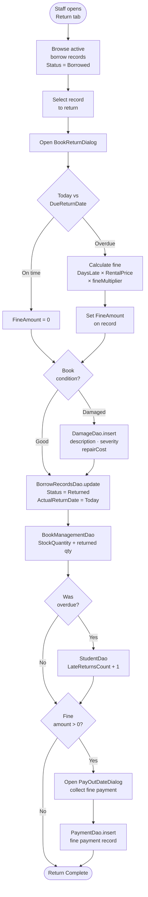
```mermaid
flowchart TD
    STAFF([Staff opens\nReturn tab]) --> BROWSE["Browse active\nborrow records\nStatus = Borrowed"]
    BROWSE --> SELECT_REC["Select record\nto return"]
    SELECT_REC --> OPEN_DIALOG["Open BookReturnDialog"]

    OPEN_DIALOG --> DATE_CHECK{"Today vs\nDueReturnDate"}
    DATE_CHECK -- "On time" --> FINE_ZERO["FineAmount = 0"]
    DATE_CHECK -- "Overdue" --> CALC_FINE["Calculate fine\nDaysLate × RentalPrice\n× fineMultiplier"]
    CALC_FINE --> FINE_SET["Set FineAmount\non record"]
    FINE_ZERO --> CONDITION
    FINE_SET --> CONDITION

    CONDITION{"Book\ncondition?"}
    CONDITION -- "Good" --> UPDATE_REC["BorrowRecordsDao.update\nStatus = Returned\nActualReturnDate = Today"]
    CONDITION -- "Damaged" --> LOG_DAMAGE["DamageDao.insert\ndescription · severity\nrepairCost"]
    LOG_DAMAGE --> UPDATE_REC

    UPDATE_REC --> STOCK_UP["BookManagementDao\nStockQuantity + returned qty"]
    STOCK_UP --> LATE_STATS{"Was\noverdue?"}
    LATE_STATS -- "Yes" --> INC_LATE["StudentDao\nLateReturnsCount + 1"]
    LATE_STATS -- "No" --> FINE_CHECK
    INC_LATE --> FINE_CHECK

    FINE_CHECK{"Fine\namount > 0?"}
    FINE_CHECK -- "Yes" --> FINE_PAY["Open PayOutDateDialog\ncollect fine payment"]
    FINE_PAY --> SAVE_FINE["PaymentDao.insert\nfine payment record"]
    FINE_CHECK -- "No" --> COMPLETE
    SAVE_FINE --> COMPLETE([Return Complete])
```

### Payment Flow

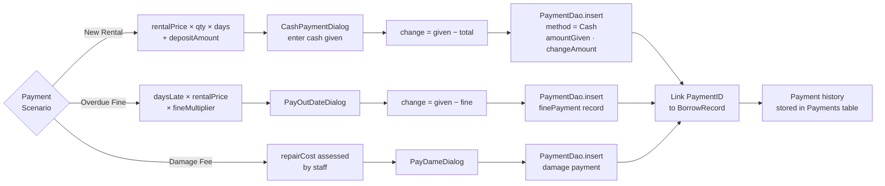
```mermaid
flowchart LR
    TYPE{"Payment\nScenario"}

    TYPE -- "New Rental" --> R_CALC["rentalPrice × qty × days\n+ depositAmount"]
    R_CALC --> CASH_DLG["CashPaymentDialog\nenter cash given"]
    CASH_DLG --> CHANGE_R["change = given − total"]
    CHANGE_R --> R_SAVE["PaymentDao.insert\nmethod = Cash\namountGiven · changeAmount"]

    TYPE -- "Overdue Fine" --> F_CALC["daysLate × rentalPrice\n× fineMultiplier"]
    F_CALC --> PAY_OUT["PayOutDateDialog"]
    PAY_OUT --> CHANGE_F["change = given − fine"]
    CHANGE_F --> F_SAVE["PaymentDao.insert\nfinePayment record"]

    TYPE -- "Damage Fee" --> D_CALC["repairCost assessed\nby staff"]
    D_CALC --> PAY_DAM["PayDameDialog"]
    PAY_DAM --> D_SAVE["PaymentDao.insert\ndamage payment"]

    R_SAVE --> LINK["Link PaymentID\nto BorrowRecord"]
    F_SAVE --> LINK
    D_SAVE --> LINK
    LINK --> HISTORY["Payment history\nstored in Payments table"]
```

### Book Management Flow

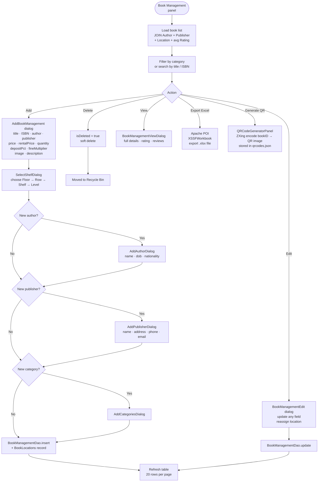
```mermaid
flowchart TD
    BM([Book Management\npanel]) --> LIST_B["Load book list\nJOIN Author + Publisher\n+ Location + avg Rating"]
    LIST_B --> FILTER["Filter by category\nor search by title / ISBN"]

    FILTER --> ACTION{"Action"}

    ACTION -- "Add" --> ADD_DLG["AddBookManagement dialog\ntitle · ISBN · author · publisher\nprice · rentalPrice · quantity\ndepositPct · fineMultiplier\nimage · description"]
    ADD_DLG --> SEL_SHELF["SelectShelfDialog\nchoose Floor → Row → Shelf → Level"]
    SEL_SHELF --> ADD_AUTHOR{"New author?"}
    ADD_AUTHOR -- "Yes" --> ADD_AU_DLG["AddAuthorDialog\nname · dob · nationality"]
    ADD_AUTHOR -- "No" --> ADD_PUB
    ADD_AU_DLG --> ADD_PUB{"New publisher?"}
    ADD_PUB -- "Yes" --> ADD_PUB_DLG["AddPublisherDialog\nname · address · phone · email"]
    ADD_PUB -- "No" --> ADD_CAT
    ADD_PUB_DLG --> ADD_CAT{"New category?"}
    ADD_CAT -- "Yes" --> ADD_CAT_DLG["AddCategoriesDialog"]
    ADD_CAT -- "No" --> SAVE_BOOK
    ADD_CAT_DLG --> SAVE_BOOK["BookManagementDao.insert\n+ BookLocations record"]

    ACTION -- "Edit" --> EDIT_DLG["BookManagementEdit dialog\nupdate any field\nreassign location"]
    EDIT_DLG --> SAVE_EDIT["BookManagementDao.update"]

    ACTION -- "Delete" --> SOFT_DEL["isDeleted = true\nsoft delete"]
    SOFT_DEL --> RECYCLE["Moved to Recycle Bin"]

    ACTION -- "View" --> VIEW_DLG["BookManagementViewDialog\nfull details · rating · reviews"]

    ACTION -- "Export Excel" --> EXPORT["Apache POI\nXSSFWorkbook\nexport .xlsx file"]

    ACTION -- "Generate QR" --> QR_GEN["QRCodeGeneratorPanel\nZXing encode bookID → QR image\nstored in qrcodes.json"]

    SAVE_BOOK --> RELOAD["Refresh table\n20 rows per page"]
    SAVE_EDIT --> RELOAD
```

### Student Management Flow

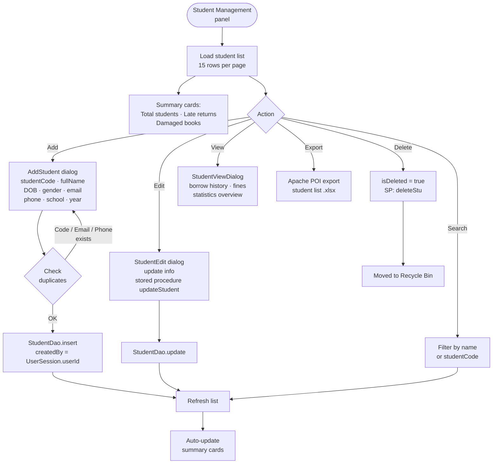
```mermaid
flowchart TD
    SM([Student Management\npanel]) --> LOAD["Load student list\n15 rows per page"]
    LOAD --> STATS_CARDS["Summary cards:\nTotal students · Late returns\nDamaged books"]

    LOAD --> ACT{"Action"}

    ACT -- "Add" --> ADD_STU["AddStudent dialog\nstudentCode · fullName\nDOB · gender · email\nphone · school · year"]
    ADD_STU --> DUP_CHK{"Check\nduplicates"}
    DUP_CHK -- "Code / Email / Phone\nexists" --> ADD_STU
    DUP_CHK -- "OK" --> SAVE_STU["StudentDao.insert\ncreatedBy = UserSession.userId"]
    SAVE_STU --> RELOAD_L["Refresh list"]

    ACT -- "Edit" --> EDIT_STU["StudentEdit dialog\nupdate info\nstored procedure updateStudent"]
    EDIT_STU --> SAVE_EDIT["StudentDao.update"]
    SAVE_EDIT --> RELOAD_L

    ACT -- "Delete" --> SOFT_DEL_S["isDeleted = true\nSP: deleteStu"]
    SOFT_DEL_S --> BIN_S["Moved to Recycle Bin"]

    ACT -- "View" --> VIEW_STU["StudentViewDialog\nborrow history · fines\nstatistics overview"]

    ACT -- "Export" --> XLS["Apache POI export\nstudent list .xlsx"]

    ACT -- "Search" --> SEARCH_S["Filter by name\nor studentCode"]
    SEARCH_S --> RELOAD_L

    RELOAD_L --> STAT_UPDATE["Auto-update\nsummary cards"]
```

### Warehouse & QR Inventory Flow

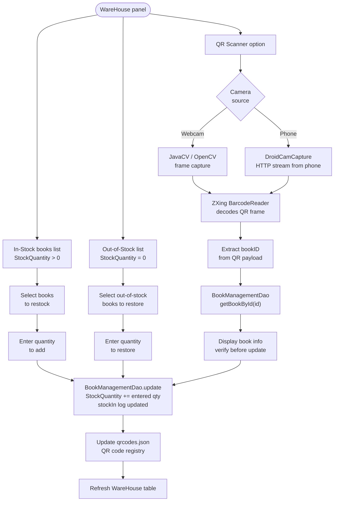
```mermaid
flowchart TD
    WH([WareHouse panel]) --> IN["In-Stock books list\nStockQuantity > 0"]
    WH --> OUT["Out-of-Stock list\nStockQuantity = 0"]
    WH --> QR_SCAN["QR Scanner option"]

    IN --> SEL_IN["Select books\nto restock"]
    OUT --> SEL_OUT["Select out-of-stock\nbooks to restore"]

    SEL_IN --> QTY_IN["Enter quantity\nto add"]
    SEL_OUT --> QTY_OUT["Enter quantity\nto restore"]
    QTY_IN --> UPDATE_STOCK
    QTY_OUT --> UPDATE_STOCK["BookManagementDao.update\nStockQuantity += entered qty\nstockIn log updated"]

    QR_SCAN --> CAM_TYPE{"Camera\nsource"}
    CAM_TYPE -- "Webcam" --> WEBCAM["JavaCV / OpenCV\nframe capture"]
    CAM_TYPE -- "Phone" --> DROIDCAM["DroidCamCapture\nHTTP stream from phone"]
    WEBCAM --> ZXING_W["ZXing BarcodeReader\ndecodes QR frame"]
    DROIDCAM --> ZXING_W
    ZXING_W --> BOOK_ID["Extract bookID\nfrom QR payload"]
    BOOK_ID --> LOOKUP["BookManagementDao\ngetBookById(id)"]
    LOOKUP --> VERIFY["Display book info\nverify before update"]
    VERIFY --> UPDATE_STOCK

    UPDATE_STOCK --> LOG_JSON["Update qrcodes.json\nQR code registry"]
    LOG_JSON --> RELOAD_WH["Refresh WareHouse table"]
```

### Location Management Flow

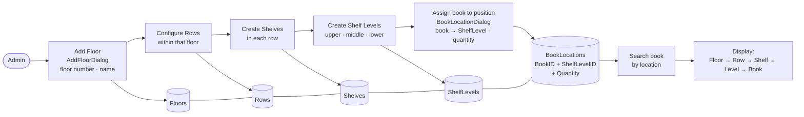
```mermaid
flowchart LR
    ADMIN([Admin]) --> FLOOR["Add Floor\nAddFloorDialog\nfloor number · name"]
    FLOOR --> ROW["Configure Rows\nwithin that floor"]
    ROW --> SHELF["Create Shelves\nin each row"]
    SHELF --> LEVEL["Create Shelf Levels\nupper · middle · lower"]
    LEVEL --> ASSIGN["Assign book to position\nBookLocationDialog\nbook → ShelfLevel · quantity"]

    ASSIGN --> BKLOC[("BookLocations\nBookID + ShelfLevelID\n+ Quantity")]

    BKLOC --> SEARCH_LOC["Search book\nby location"]
    SEARCH_LOC --> DISPLAY["Display:\nFloor → Row → Shelf → Level → Book"]

    FLOOR --> FLOORS_T[("Floors")]
    ROW --> ROWS_T[("Rows")]
    SHELF --> SHELVES_T[("Shelves")]
    LEVEL --> LEVELS_T[("ShelfLevels")]

    FLOORS_T --- ROWS_T --- SHELVES_T --- LEVELS_T --- BKLOC
```

### Damage & Recycle Workflow

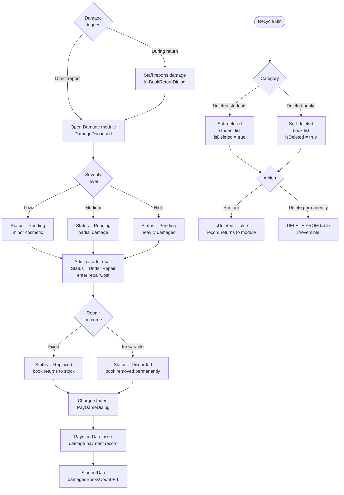
```mermaid
flowchart TD
    TRIGGER{"Damage\ntrigger"}

    TRIGGER -- "During return" --> RET["Staff reports damage\nin BookReturnDialog"]
    TRIGGER -- "Direct report" --> DAM["Open Damage module\nDamageDao.insert"]
    RET --> DAM

    DAM --> SEV{"Severity\nlevel"}
    SEV -- "Low" --> P_LOW["Status = Pending\nminor cosmetic"]
    SEV -- "Medium" --> P_MED["Status = Pending\npartial damage"]
    SEV -- "High" --> P_HIGH["Status = Pending\nheavily damaged"]

    P_LOW --> REPAIR
    P_MED --> REPAIR
    P_HIGH --> REPAIR

    REPAIR["Admin starts repair\nStatus = Under Repair\nenter repairCost"] --> RESULT{"Repair\noutcome"}
    RESULT -- "Fixed" --> REPLACED["Status = Replaced\nbook returns to stock"]
    RESULT -- "Irreparable" --> DISCARD["Status = Discarded\nbook removed permanently"]

    REPLACED --> CHARGE["Charge student\nPayDameDialog"]
    DISCARD --> CHARGE

    CHARGE --> DAM_PAY["PaymentDao.insert\ndamage payment record"]
    DAM_PAY --> STATS_DAM["StudentDao\ndamagedBooksCount + 1"]

    BIN_SECTION([Recycle Bin]) --> RB_TABS{"Category"}
    RB_TABS -- "Deleted students" --> STU_BIN["Soft-deleted\nstudent list\nisDeleted = true"]
    RB_TABS -- "Deleted books" --> BOOK_BIN["Soft-deleted\nbook list\nisDeleted = true"]

    STU_BIN --> RB_ACT{"Action"}
    BOOK_BIN --> RB_ACT
    RB_ACT -- "Restore" --> RESTORE["isDeleted = false\nrecord returns to module"]
    RB_ACT -- "Delete permanently" --> HARD_DEL["DELETE FROM table\nirreversible"]
```

### Charts & Reports Flow

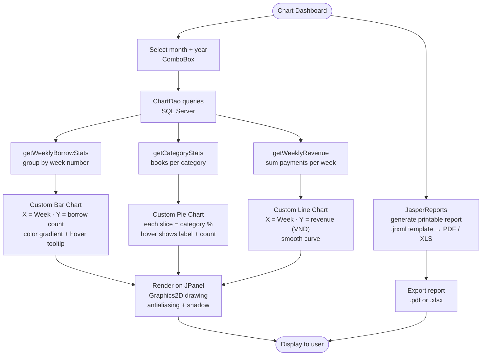
```mermaid
flowchart TD
    CHART([Chart Dashboard]) --> SELECT_MONTH["Select month + year\nComboBox"]
    SELECT_MONTH --> LOAD_DATA["ChartDao queries\nSQL Server"]

    LOAD_DATA --> WEEKLY["getWeeklyBorrowStats\ngroup by week number"]
    LOAD_DATA --> CATEGORY["getCategoryStats\nbooks per category"]
    LOAD_DATA --> REVENUE["getWeeklyRevenue\nsum payments per week"]

    WEEKLY --> BAR["Custom Bar Chart\nX = Week · Y = borrow count\ncolor gradient + hover tooltip"]
    CATEGORY --> PIE["Custom Pie Chart\neach slice = category %\nhover shows label + count"]
    REVENUE --> LINE["Custom Line Chart\nX = Week · Y = revenue (VND)\nsmooth curve"]

    BAR --> RENDER["Render on JPanel\nGraphics2D drawing\nantialiasing + shadow"]
    PIE --> RENDER
    LINE --> RENDER

    CHART --> JASPER["JasperReports\ngenerate printable report\n.jrxml template → PDF / XLS"]
    JASPER --> EXPORT_R["Export report\n.pdf or .xlsx"]

    RENDER --> DISPLAY([Display to user])
    EXPORT_R --> DISPLAY
```

### Admin Module Overview & Permissions

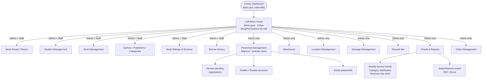
```mermaid
flowchart TD
    DASH([Library Dashboard\nMain.java 1400×850]) --> MENU["Left Menu Panel\nMenu.java · 215px\nsetupPermissions by role"]

    MENU --> |"Admin + Staff"| RENTAL_M["Book Rental / Return"]
    MENU --> |"Admin + Staff"| STUDENT_M["Student Management"]
    MENU --> |"Admin + Staff"| BOOK_M["Book Management"]
    MENU --> |"Admin + Staff"| AUTHOR_M["Authors / Publishers / Categories"]
    MENU --> |"Admin + Staff"| RATING_M["Book Ratings & Reviews"]
    MENU --> |"Admin + Staff"| HIST_M["Borrow History"]

    MENU --> |"Admin only"| PERSON_M["Personnel Management\nApprove / activate users"]
    MENU --> |"Admin only"| WARE_M["Warehouse"]
    MENU --> |"Admin only"| LOC_M["Location Management"]
    MENU --> |"Admin only"| DMG_M["Damage Management"]
    MENU --> |"Admin only"| BIN_M["Recycle Bin"]
    MENU --> |"Admin only"| CHART_M["Charts & Reports"]
    MENU --> |"Admin only"| ORDER_M["Order Management"]

    PERSON_M --> APPROVE_U["Review pending\nregistrations"]
    PERSON_M --> TOGGLE_U["Enable / Disable accounts"]
    PERSON_M --> PWD_U["Reset passwords"]

    CHART_M --> STATS_C["Weekly borrow trends\nCategory distribution\nRevenue line chart"]
    CHART_M --> JASPER_C["JasperReports export\nPDF / Excel"]
```

### Database Relationships

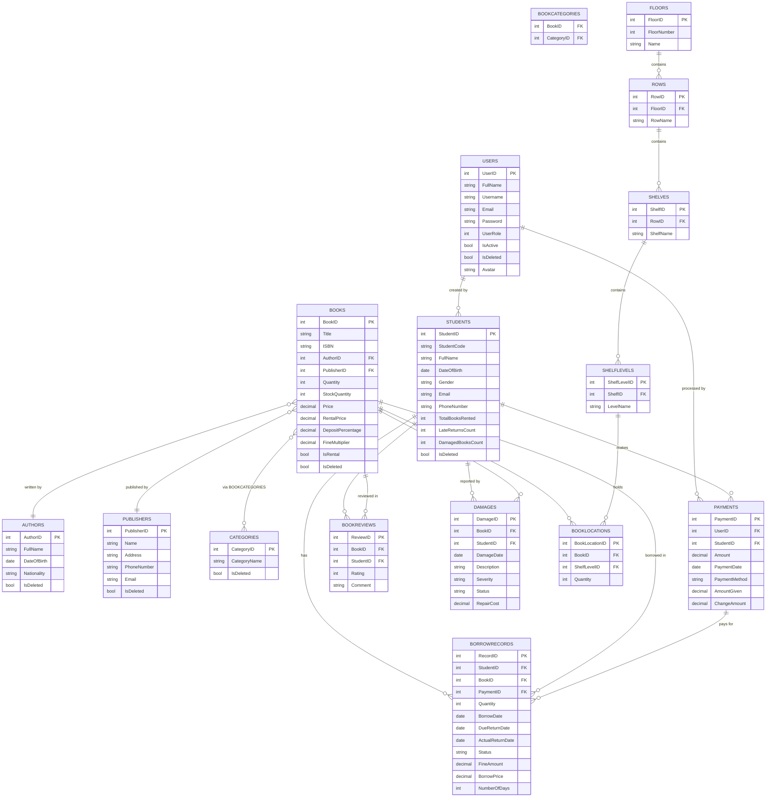
```mermaid
erDiagram
    USERS {
        int UserID PK
        string FullName
        string Username
        string Email
        string Password
        int UserRole
        bool IsActive
        bool IsDeleted
        string Avatar
    }
    STUDENTS {
        int StudentID PK
        string StudentCode
        string FullName
        date DateOfBirth
        string Gender
        string Email
        string PhoneNumber
        int TotalBooksRented
        int LateReturnsCount
        int DamagedBooksCount
        bool IsDeleted
    }
    BOOKS {
        int BookID PK
        string Title
        string ISBN
        int AuthorID FK
        int PublisherID FK
        int Quantity
        int StockQuantity
        decimal Price
        decimal RentalPrice
        decimal DepositPercentage
        decimal FineMultiplier
        bool IsRental
        bool IsDeleted
    }
    AUTHORS {
        int AuthorID PK
        string FullName
        date DateOfBirth
        string Nationality
        bool IsDeleted
    }
    PUBLISHERS {
        int PublisherID PK
        string Name
        string Address
        string PhoneNumber
        string Email
        bool IsDeleted
    }
    CATEGORIES {
        int CategoryID PK
        string CategoryName
        bool IsDeleted
    }
    BOOKCATEGORIES {
        int BookID FK
        int CategoryID FK
    }
    BORROWRECORDS {
        int RecordID PK
        int StudentID FK
        int BookID FK
        int PaymentID FK
        int Quantity
        date BorrowDate
        date DueReturnDate
        date ActualReturnDate
        string Status
        decimal FineAmount
        decimal BorrowPrice
        int NumberOfDays
    }
    PAYMENTS {
        int PaymentID PK
        int UserID FK
        int StudentID FK
        decimal Amount
        date PaymentDate
        string PaymentMethod
        decimal AmountGiven
        decimal ChangeAmount
    }
    BOOKREVIEWS {
        int ReviewID PK
        int BookID FK
        int StudentID FK
        int Rating
        string Comment
    }
    DAMAGES {
        int DamageID PK
        int BookID FK
        int StudentID FK
        date DamageDate
        string Description
        string Severity
        string Status
        decimal RepairCost
    }
    FLOORS {
        int FloorID PK
        int FloorNumber
        string Name
    }
    ROWS {
        int RowID PK
        int FloorID FK
        string RowName
    }
    SHELVES {
        int ShelfID PK
        int RowID FK
        string ShelfName
    }
    SHELFLEVELS {
        int ShelfLevelID PK
        int ShelfID FK
        string LevelName
    }
    BOOKLOCATIONS {
        int BookLocationID PK
        int BookID FK
        int ShelfLevelID FK
        int Quantity
    }

    USERS ||--o{ PAYMENTS : "processed by"
    USERS ||--o{ STUDENTS : "created by"
    STUDENTS ||--o{ PAYMENTS : "makes"
    STUDENTS ||--o{ BORROWRECORDS : "has"
    STUDENTS ||--o{ BOOKREVIEWS : "writes"
    STUDENTS ||--o{ DAMAGES : "reported by"
    BOOKS ||--o{ BORROWRECORDS : "borrowed in"
    BOOKS ||--o{ BOOKREVIEWS : "reviewed in"
    BOOKS ||--o{ DAMAGES : "damage cases"
    BOOKS ||--o{ BOOKLOCATIONS : "stored in"
    BOOKS }o--|| AUTHORS : "written by"
    BOOKS }o--|| PUBLISHERS : "published by"
    BOOKS }o--o{ CATEGORIES : "via BOOKCATEGORIES"
    PAYMENTS ||--o{ BORROWRECORDS : "pays for"
    FLOORS ||--o{ ROWS : "contains"
    ROWS ||--o{ SHELVES : "contains"
    SHELVES ||--o{ SHELFLEVELS : "contains"
    SHELFLEVELS ||--o{ BOOKLOCATIONS : "holds"
```

### Borrow Record Lifecycle

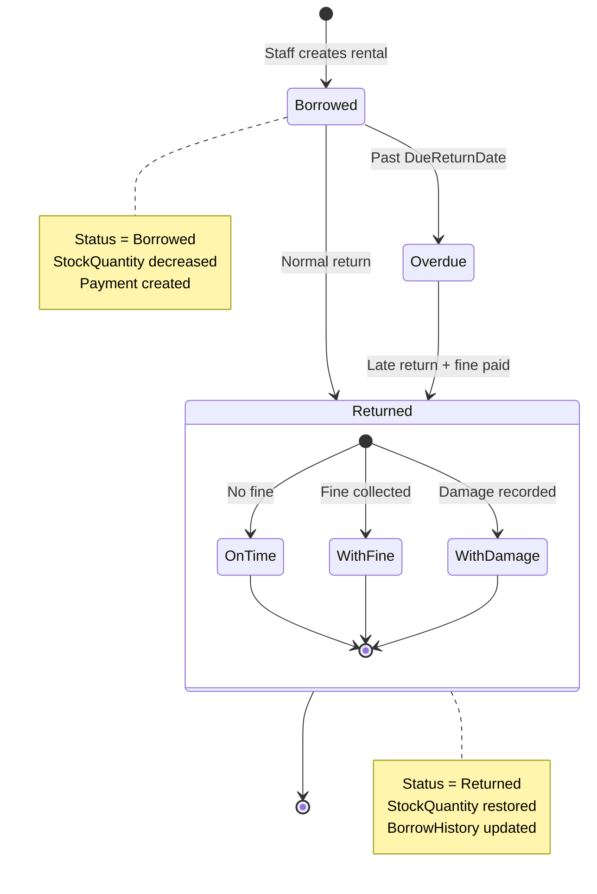
```mermaid
stateDiagram-v2
    [*] --> Borrowed : Staff creates rental
    Borrowed --> Returned : Normal return
    Borrowed --> Overdue : Past DueReturnDate
    Overdue --> Returned : Late return + fine paid
    Returned --> [*]

    state Returned {
        [*] --> OnTime : No fine
        [*] --> WithFine : Fine collected
        [*] --> WithDamage : Damage recorded
        OnTime --> [*]
        WithFine --> [*]
        WithDamage --> [*]
    }

    note right of Borrowed
        Status = Borrowed
        StockQuantity decreased
        Payment created
    end note

    note right of Returned
        Status = Returned
        StockQuantity restored
        BorrowHistory updated
    end note
```

## Repository Structure

- `system-flow.html`: visual system documentation with Mermaid diagrams
- `docs/screenshots`: curated screenshots extracted from the project report
- `docs/features`: feature summaries for admin and staff workflows
- `docs/api`: notes on external integrations such as Vbee audio and QR scanning
- `docs/demo`: demo availability notes
- `docs/deployment`: stack and local run notes
- `docs/diagrams`: ERD and diagram notes
- `portfolio`: summary of project scope, responsibilities, and problem-solving notes

## What Is Public Here

- Project summary
- Feature overview
- System flow diagrams
- Selected screenshots
- Database ERD
- My role and contribution summary
- Technical notes for reviewers

## What Is Not Included

- Full Java source code
- Full SQL scripts and production data
- Configuration secrets
- Private implementation details
- Internal development repository history

## Private Source Code Note

The full implementation repository for this project is private.

This public showcase repository exists to help recruiters and interviewers review:

- the problem the project solves
- the product scope
- the UI and workflows
- the technical architecture at a high level
- the parts I personally contributed

If you would like a deeper walkthrough, I can provide:

- a recorded demo
- a guided screen-sharing walkthrough
- explanation of selected modules and implementation decisions

## Supporting Documents

- Feature summaries: [docs/features](docs/features)
- Integrations and external services: [docs/api/integrations-notes.md](docs/api/integrations-notes.md)
- Deployment and stack notes: [docs/deployment/tech-stack.md](docs/deployment/tech-stack.md)
- Diagram notes: [docs/diagrams/README.md](docs/diagrams/README.md)
- Demo notes: [docs/demo/demo-link.md](docs/demo/demo-link.md)
- Video availability note: [docs/demo/video-link.md](docs/demo/video-link.md)
- Project summary: [portfolio/project-summary.md](portfolio/project-summary.md)
- Responsibilities: [portfolio/responsibilities.md](portfolio/responsibilities.md)
- Challenges and solutions: [portfolio/challenges-and-solutions.md](portfolio/challenges-and-solutions.md)
